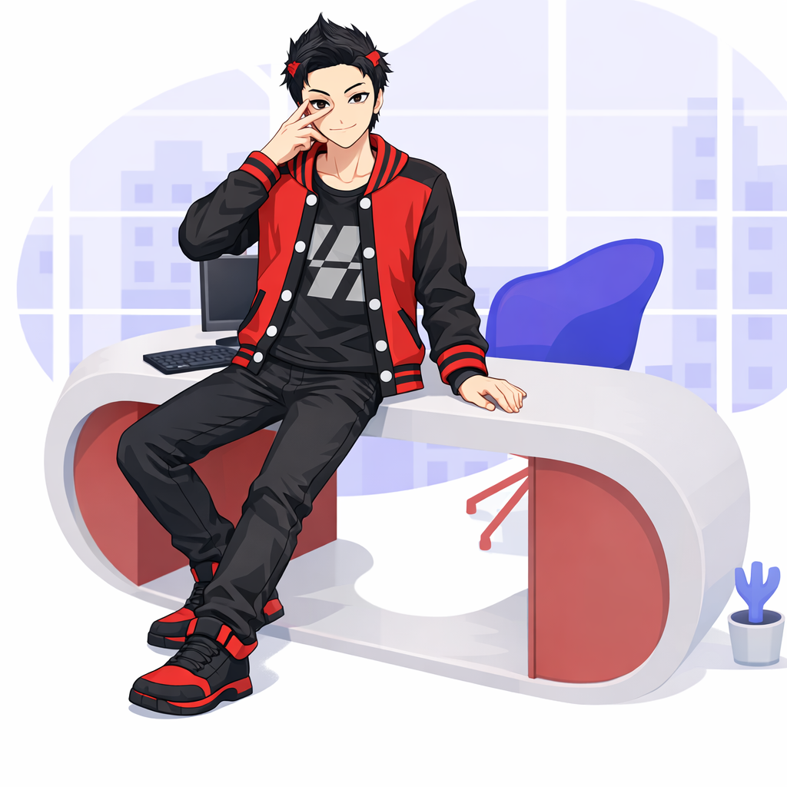
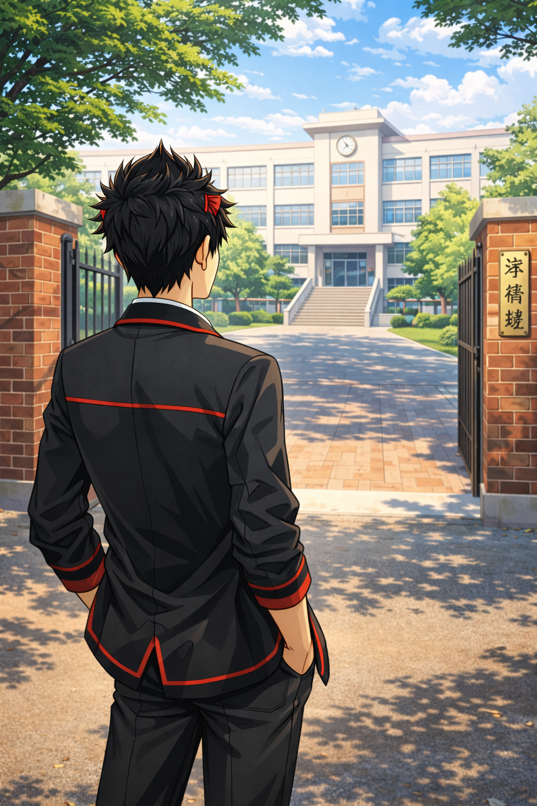
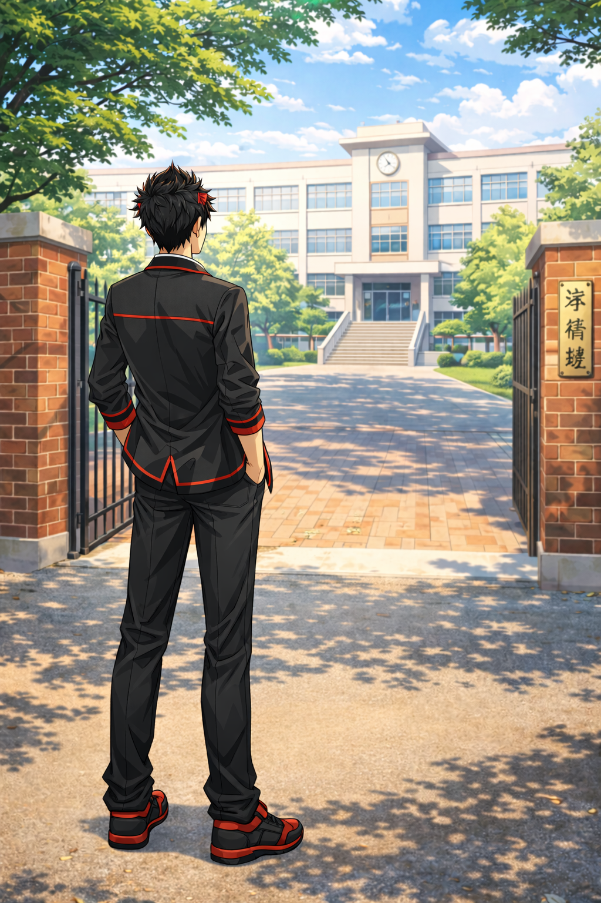
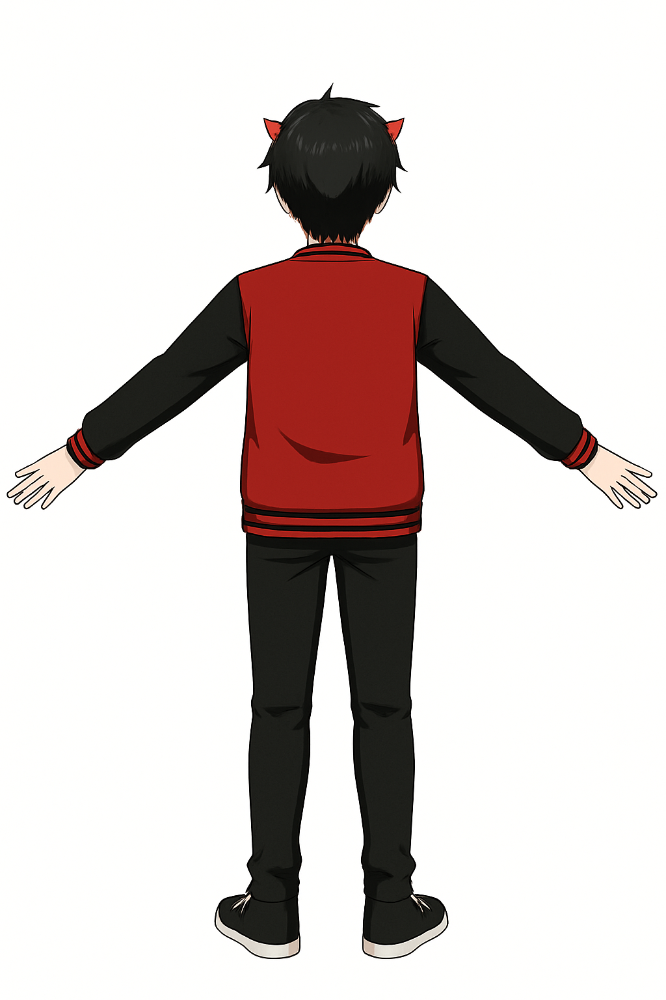
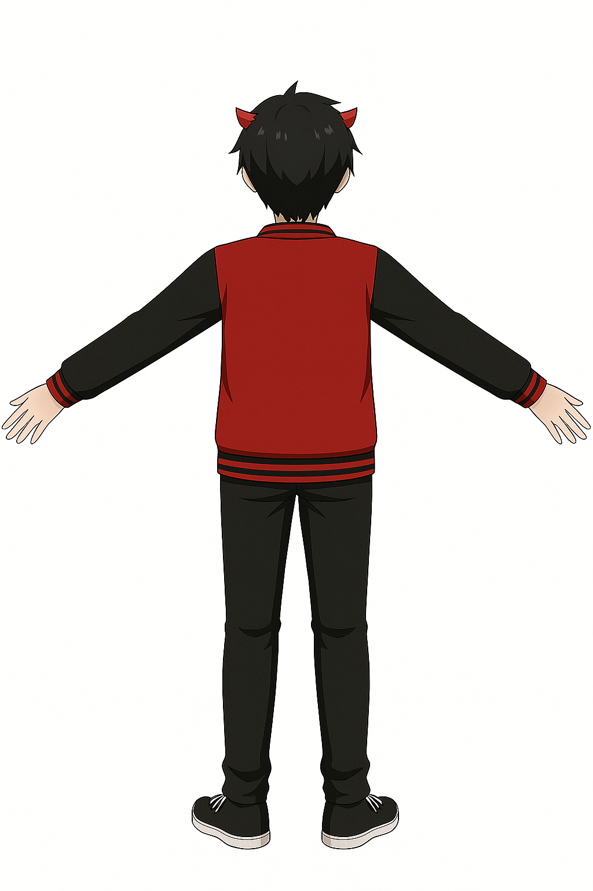

<!-- ═══════════════════ HEADER WAVE ═══════════════════ -->


<!-- ═══════════════════ INTRO SECTION — LEFT/RIGHT ═══════════════════ -->

<table>
<tr>
<td width="55%" valign="top">

### 👋 Hola! Saya **Kuro**, pemilik MYTHS

> *Di antara riuh dunia digital, lahirlah Kuro — seorang pengelana imajinasi yang mencari jalan untuk menghubungkan kode, seni, dan cerita.*

- 🎭 Creator di balik **MYTHS**
- 💡 Suka ngembangin ide jadi dunia digital
- 🐉 Fans dunia fantasi, RPG, dan storytelling
- 🎨 Kadang ngulik desain + seni visual
- 🔭 Sedang mengerjakan **[Global Map](https://github.com/kuro-myths/global-map)** & **[Awakening](https://github.com/kuro-myths/awakening)**
- 🌱 Sedang belajar **Laravel**, **Python**, dan **Game Dev**
- ⚡ Fun fact: *Setiap baris kode adalah mantra, setiap project adalah dunia baru*

</td>
<td width="45%" align="center">


<br><br>

<br><br>


</td>
</tr>
</table>

---

<!-- ═══════════════════ TECH STACK ═══════════════════ -->

<table>
<tr>
<td width="40%" align="center">

### 🛠️ Tech & Tools

</td>
<td width="60%">


</td>
</tr>
</table>

---

<!-- ═══════════════════ GITHUB STATS — SIDE BY SIDE ═══════════════════ -->

### 📊 GitHub Stats

<table>
<tr>
<td width="50%">


</td>
<td width="50%">


</td>
</tr>
</table>

<table>
<tr>
<td width="33%">


</td>
<td width="33%">


</td>
<td width="33%">


</td>
</tr>
</table>

---

<!-- ═══════════════════ CONTRIBUTION GRAPH ═══════════════════ -->

### 📈 Contribution Activity


---

<!-- ═══════════════════ SNAKE CONTRIBUTION ═══════════════════ -->

### 🐉 Myths Dragon Contributions

<p align="center"><i>"Naga MYTHS memakan kontribusi GitHub-mu!"</i></p>

<p align="center">
  <picture>
    <source media="(prefers-color-scheme: dark)" srcset="https://raw.githubusercontent.com/kuro-myths/ular/output/github-snake-dark.svg" />
    <source media="(prefers-color-scheme: light)" srcset="https://raw.githubusercontent.com/kuro-myths/ular/output/github-snake.svg" />
    
  </picture>
</p>

---

<!-- ═══════════════════ GALLERY KURO ═══════════════════ -->

### 🎨 Gallery Kuro

<table>
<tr>
<td width="25%" align="center">

</td>
<td width="25%" align="center">

</td>
<td width="25%" align="center">

</td>
<td width="25%" align="center">

</td>
</tr>
<tr>
<td width="25%" align="center">

</td>
<td width="25%" align="center">

</td>
<td width="25%" align="center">

</td>
<td width="25%" align="center">

</td>
</tr>
</table>

---

<!-- ═══════════════════ FEATURED PROJECTS ═══════════════════ -->

### ⚔️ Featured Projects

<table>
<tr>
<td width="50%">

🗺️ **[Global Map](https://github.com/kuro-myths/global-map)** — Peta dunia MYTHS yang interaktif

 

</td>
<td width="50%">

⚔️ **[Awakening](https://github.com/kuro-myths/awakening)** — Portal Legenda Awakening

 

</td>
</tr>
<tr>
<td width="50%">

🐍 **[Ular Snake](https://github.com/kuro-myths/ular)** — Snake contribution animation generator

 

</td>
<td width="50%">

🐉 **[Kuro Myths](https://github.com/kuro-myths/kuro-myths)** — Profile README ini!

 

</td>
</tr>
</table>

---

<!-- ═══════════════════ QUOTE & CONNECT — SIDE BY SIDE ═══════════════════ -->

<table>
<tr>
<td width="55%" valign="top">

### 📅 Random Dev Quote


<br>

### 🎯 Random Dev Meme


</td>
<td width="45%" valign="top">

### 📬 Connect With Me

Jangan ragu buat ngobrol atau kolaborasi!

[](#)
[](#)
[](#)
[](#)

---

### 💰 Support MYTHS

Kalau suka dengan karya saya:

[](#)
[](#)

</td>
</tr>
</table>

---

<!-- ═══════════════════ SPOTIFY / RECENT ACTIVITY ═══════════════════ -->

<table>
<tr>
<td width="50%" valign="top">

### 📌 Hal yang Sedang Dikerjakan

- 🔨 Membangun dunia **MYTHS** lebih luas
- 🗺️ Developing **Global Map** project
- ⚔️ Writing lore untuk **Legenda Awakening**
- 📚 Belajar backend **Laravel** & **Python**
- 🎨 Eksperimen desain visual baru

</td>
<td width="50%" valign="top">

### 🏅 Badges & Achievements


</td>
</tr>
</table>

---

<!-- ═══════════════════ GITHUB METRICS ═══════════════════ -->

### 🧬 GitHub Metrics

<table>
<tr>
<td width="50%" valign="top">

#### 📦 Repository Stats

| Metric | Value |
|---|---|
|  |  |
|  |  |
|  |  |
|  |  |
|  |  |

</td>
<td width="50%" valign="top">

#### 🔄 Repo Details — kuro-myths


</td>
</tr>
</table>

---

<!-- ═══════════════════ ALL REPOS OVERVIEW ═══════════════════ -->

### 📂 All Repositories Overview

<table>
<tr>
<td align="center" width="25%">

**🗺️ global-map**


[🔗 View](https://github.com/kuro-myths/global-map)

</td>
<td align="center" width="25%">

**⚔️ awakening**


[🔗 View](https://github.com/kuro-myths/awakening)

</td>
<td align="center" width="25%">

**🐍 ular**


[🔗 View](https://github.com/kuro-myths/ular)

</td>
<td align="center" width="25%">

**🐉 kuro-myths**


[🔗 View](https://github.com/kuro-myths/kuro-myths)

</td>
</tr>
</table>

---

<!-- ═══════════════════ WAKATIME / CODING STATS ═══════════════════ -->

### ⏱️ Coding Journey

<table>
<tr>
<td width="60%" valign="top">

#### 📊 Language Breakdown

```text
HTML         ████████████████░░░░░   76.2%
CSS          ██░░░░░░░░░░░░░░░░░░░    8.5%
JavaScript   ██░░░░░░░░░░░░░░░░░░░    6.3%
Python       █░░░░░░░░░░░░░░░░░░░░    4.1%
Blade        █░░░░░░░░░░░░░░░░░░░░    3.2%
PHP          ░░░░░░░░░░░░░░░░░░░░░    1.7%
```

</td>
<td width="40%" valign="top">

#### 🎮 Fun Stats

```text
🏆 Total Commits     266+
📦 Total Repos       4+
🔥 Current Streak    9 days
⭐ Stars Earned      1+
🔀 Total PRs         6
📝 Total Issues      1
🌍 Contributed to    42 repos
```

</td>
</tr>
</table>

---

<!-- ═══════════════════ GITHUB SKYLINE ═══════════════════ -->

### 🏙️ GitHub 3D Skyline & More

<table>
<tr>
<td width="33%" align="center">

[](https://skyline.github.com/kuro-myths/2025)

Lihat kontribusimu dalam bentuk 3D cityscape!

</td>
<td width="33%" align="center">

[](https://www.githubwrapped.io/kuro-myths)

Rangkuman setahun coding-mu!

</td>
<td width="33%" align="center">

[](https://profile-summary-for-github.com/user/kuro-myths)

Analisis lengkap profil GitHub-mu!

</td>
</tr>
</table>

---

<!-- ═══════════════════ COMMIT CALENDAR HEATMAP ═══════════════════ -->

### 🗓️ Kontribusi Mingguan

<table>
<tr>
<td width="50%" valign="top">

#### 📅 Commit Activity per Repo

| Repo | Commits | Activity |
|:---|:---:|:---|
| 🗺️ global-map |  |  |
| ⚔️ awakening |  |  |
| 🐍 ular |  |  |
| 🐉 kuro-myths |  |  |

</td>
<td width="50%" valign="top">

#### 🕐 Kapan Kuro Paling Aktif?

```text
Senin        ██████░░░░░░░   44%
Selasa       ████░░░░░░░░░   30%
Rabu         ████████░░░░░   60%
Kamis        ██████████░░░   78%
Jumat        █████████████   100%🔥
Sabtu        ████████░░░░░   62%
Minggu       ███░░░░░░░░░░   22%
```

</td>
</tr>
</table>

---

<!-- ═══════════════════ REPO LANGUAGES & TOPICS ═══════════════════ -->

### 🏷️ Topics & Skills

<p align="center">


</p>

---

<!-- ═══════════════════ ISSUE & PR STATUS ═══════════════════ -->

### 🔧 Open Source Status

<table>
<tr>
<td width="50%">

#### 📋 Issues & Pull Requests

| Repo | Issues | PRs |
|:---|:---:|:---:|
| global-map |  |  |
| awakening |  |  |
| ular |  |  |
| kuro-myths |  |  |

</td>
<td width="50%">

#### ✅ Health Badges


</td>
</tr>
</table>

---

<!-- ═══════════════════ GITHUB ACTIONS ═══════════════════ -->

### ⚙️ GitHub Actions & Workflows

<table>
<tr>
<td width="50%">

#### 🤖 Active Workflows

| Workflow | Status |
|:---|:---:|
| 🐍 Snake Animation |  |
| 🚀 GitHub Pages |  |

</td>
<td width="50%">

#### 📡 Deploy Status


</td>
</tr>
</table>

---

<!-- ═══════════════════ FOOTER ═══════════════════ -->

<p align="center">
  <i>"Di MYTHS, setiap baris kode adalah mantra, dan setiap project adalah dunia baru." 🌌</i>
</p>


